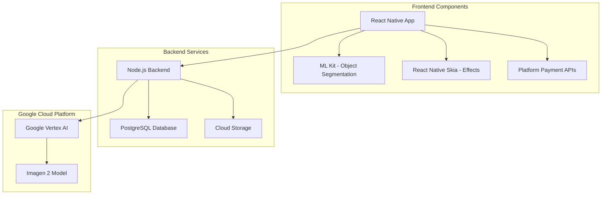

# Design Document

## Overview

The AI Sticker Generation system is a cloud-based mobile application that transforms user photos into artistic stickers using Google's Imagen 2 AI model. The system follows a client-server architecture where the React Native frontend handles user interactions and basic image processing, while the Node.js backend manages AI API calls, user authentication, and credit management.

## Architecture

### High-Level Architecture



### System Flow

1. **Photo Selection & Segmentation**: User selects photo → ML Kit performs object segmentation → Segmented image prepared for AI processing
2. **Style Selection**: User chooses artistic style → Frontend validates selection → Style parameters prepared
3. **AI Processing**: Backend receives request → Validates user credits → Authenticates with Vertex AI → Sends image and style to Imagen 2 → Receives transformed result → Deducts credits from user account
4. **Post-Processing**: User applies effects using Skia → Final sticker packaged → Exported to messaging platforms

## Components and Interfaces

### Frontend Components

#### PhotoSelectionComponent
- **Purpose**: Handle photo selection from camera/gallery
- **Dependencies**: react-native-image-picker, react-native-permissions
- **Key Methods**:
  - `selectFromGallery()`: Opens device gallery
  - `captureFromCamera()`: Opens camera interface
  - `validateImage(image)`: Checks format, size, and quality

#### MLKitSegmentationComponent
- **Purpose**: Perform automatic object segmentation
- **Dependencies**: @react-native-ml-kit/image-segmentation
- **Key Methods**:
  - `segmentObject(imageUri)`: Performs ML Kit segmentation
  - `extractForeground()`: Isolates main object
  - `createTransparentBackground()`: Removes background
  - `provideManualEditingTools()`: Fallback manual editing when auto-segmentation fails

#### StyleSelectionComponent
- **Purpose**: Display and manage artistic style options
- **State Management**: Zustand store for selected style
- **Key Methods**:
  - `loadAvailableStyles()`: Fetches style options from backend
  - `previewStyle(styleId)`: Shows style preview
  - `confirmSelection()`: Validates and proceeds with chosen style

#### SkiaEffectsComponent
- **Purpose**: Apply finishing touches using react-native-skia
- **Dependencies**: @shopify/react-native-skia
- **Key Methods**:
  - `addBorder(width, color)`: Adds customizable borders
  - `applyShadow(offset, blur, color)`: Creates shadow effects
  - `renderRealTime()`: Live preview of effects

#### StickerExportComponent
- **Purpose**: Package and export stickers
- **Dependencies**: react-native-share, WhatsApp Stickers API
- **Key Methods**:
  - `packageForWhatsApp()`: Creates WhatsApp-compatible sticker pack
  - `saveToGallery()`: Saves to device storage
  - `shareToApps()`: Integrates with sharing APIs

### Backend Services

#### AuthenticationService
- **Purpose**: Manage user registration, login, and session management
- **Technology**: JWT tokens, bcrypt for password hashing
- **Key Methods**:
  - `registerUser(email, password)`: Creates new user account
  - `authenticateUser(credentials)`: Validates login
  - `generateJWT(userId)`: Creates session token

#### ImageProcessingService
- **Purpose**: Handle image uploads and preprocessing
- **Dependencies**: multer, sharp
- **Key Methods**:
  - `uploadImage(file)`: Receives and validates uploaded images
  - `compressImage(image, quality)`: Optimizes image size
  - `prepareForAI(segmentedImage, style)`: Formats for Vertex AI

#### VertexAIService
- **Purpose**: Interface with Google Vertex AI and Imagen 2
- **Dependencies**: @google-cloud/aiplatform
- **Key Methods**:
  - `authenticateWithGoogle()`: Manages service account credentials
  - `generateSticker(image, stylePrompt)`: Calls Imagen 2 API with optimized prompts (e.g., "Transform this image into cartoon art style with vibrant colors, bold outlines, and clean details")
  - `handleAPIResponse(response)`: Processes AI-generated results

#### CreditManagementService
- **Purpose**: Track and manage user credits
- **Database**: PostgreSQL with user_credits table
- **Key Methods**:
  - `checkUserCredits(userId)`: Validates available credits
  - `deductCredits(userId, amount)`: Processes credit consumption
  - `addCredits(userId, amount)`: Handles credit purchases

#### PaymentService
- **Purpose**: Process in-app purchases and subscriptions
- **Dependencies**: Platform-specific payment APIs
- **Key Methods**:
  - `validatePurchase(receipt)`: Verifies payment with app stores
  - `processSubscription(userId, plan)`: Handles recurring payments
  - `handleRefunds(transactionId)`: Manages refund requests

## Data Models

### User Model
```typescript
interface User {
  id: string;
  email: string;
  passwordHash: string;
  createdAt: Date;
  credits: number;
  subscriptionStatus: 'free' | 'premium';
  subscriptionExpiry?: Date;
}
```

### Sticker Model
```typescript
interface Sticker {
  id: string;
  userId: string;
  originalImageUrl: string;
  processedImageUrl: string;
  styleUsed: string;
  createdAt: Date;
  metadata: {
    processingTime: number;
    imageSize: { width: number; height: number };
    effects: string[];
  };
}
```

### Credit Transaction Model
```typescript
interface CreditTransaction {
  id: string;
  userId: string;
  type: 'purchase' | 'consumption' | 'refund';
  amount: number;
  description: string;
  timestamp: Date;
  relatedStickerIds?: string[];
}
```

### AI Processing Request Model
```typescript
interface AIProcessingRequest {
  id: string;
  userId: string;
  imageData: Buffer;
  stylePrompt: string;
  status: 'pending' | 'processing' | 'completed' | 'failed';
  vertexAIRequestId?: string;
  processingStartTime: Date;
  processingEndTime?: Date;
  resultImageUrl?: string;
  errorMessage?: string;
}
```

## Error Handling

### Frontend Error Handling
- **Network Errors**: Implement retry logic with exponential backoff
- **ML Kit Failures**: Provide manual cropping tools as fallback
- **Payment Errors**: Clear error messages with retry options
- **Image Processing Errors**: Validate image format and size before upload

### Backend Error Handling
- **Vertex AI API Errors**: Implement circuit breaker pattern for API failures
- **Database Errors**: Transaction rollback for credit operations
- **Authentication Errors**: Secure error messages without exposing system details
- **Rate Limiting**: Implement user-based and IP-based rate limiting

### Error Response Format
```typescript
interface ErrorResponse {
  success: false;
  error: {
    code: string;
    message: string;
    details?: any;
    retryable: boolean;
  };
  timestamp: Date;
}
```

## Testing Strategy

### Frontend Testing
- **Unit Tests**: Jest for component logic and utility functions
- **Integration Tests**: Detox for end-to-end user flows
- **Visual Tests**: Storybook for component visual regression
- **Performance Tests**: Flipper for React Native performance monitoring

### Backend Testing
- **Unit Tests**: Jest for service layer and business logic
- **Integration Tests**: Supertest for API endpoint testing
- **Load Tests**: Artillery for API performance under load
- **Security Tests**: OWASP ZAP for vulnerability scanning

### AI Integration Testing
- **Mock Testing**: Mock Vertex AI responses for consistent testing
- **Sandbox Testing**: Use Google Cloud test environment for integration
- **Cost Monitoring**: Track API usage during testing to prevent overages
- **Quality Assurance**: Manual testing of AI output quality across different styles

### Test Data Management
- **Synthetic Images**: Generate test images for consistent segmentation testing
- **Style Validation**: Maintain reference images for each artistic style
- **Performance Benchmarks**: Track processing times and success rates
- **User Journey Tests**: Complete end-to-end flows with real user scenarios